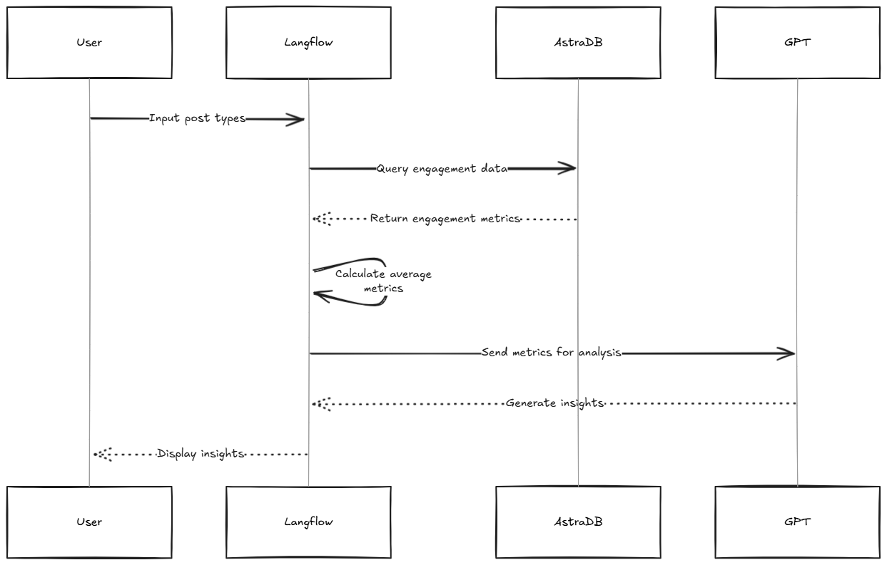
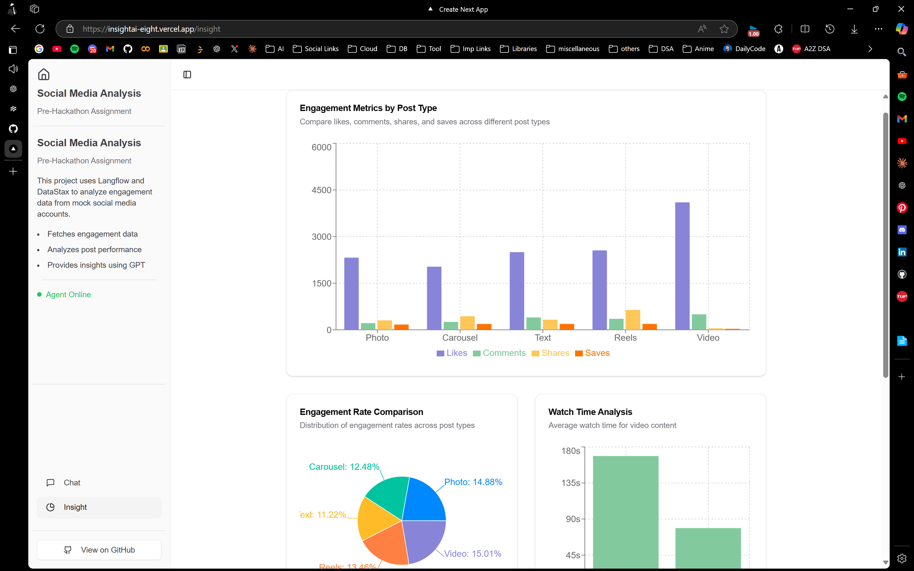
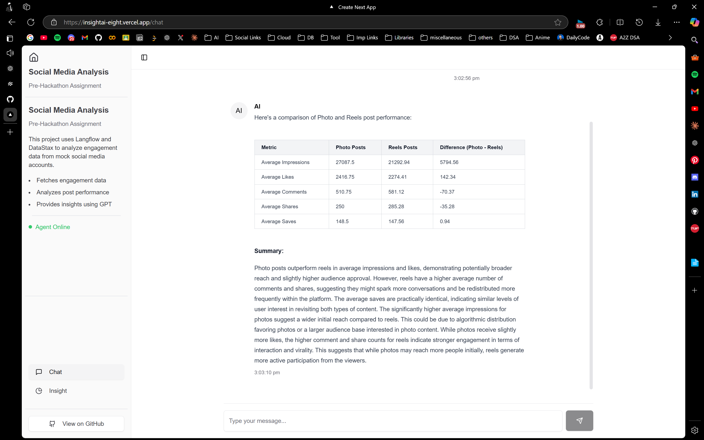
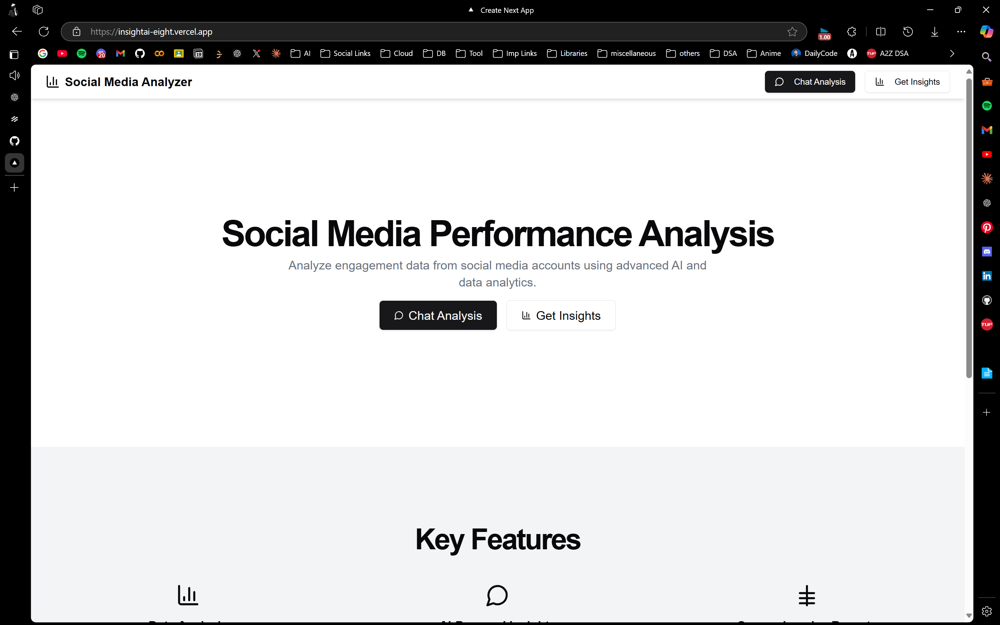

# 📊 Social Media Analyzer

## About
This project focuses on building a basic analytics module for analyzing engagement data from mock social media accounts. It utilizes [Langflow](https://www.langflow.org/) for workflow creation and GPT integration, and [DataStax Astra DB](https://www.datastax.com/products/datastax-astra) for database operations.

> 🚀 Live Demo: [https://insightai-eight.vercel.app/](https://insightai-eight.vercel.app/)

---

## 📸 Images and User Flow

### Application Flow
The application workflow involves generating and seeding data, analyzing performance, and providing insights. Below is an Excalidraw representation:







1. **Data Generation**: Python scripts create and seed mock engagement data.
2. **Performance Analysis**: Langflow workflows query Astra DB and calculate metrics.
3. **Insight Generation**: GPT provides actionable insights based on the analyzed data.

---

## 🛠️ Installation
For detailed installation steps, please refer to the [Installation Guide](./installation.md).

---

## 📂 Folder Structure
```
project-root/
├── Generate_mock_data/
│   ├── generate_mock_social_media_data.py   # Script to generate mock engagement data
│   ├── seed.py                              # Script to seed data into Astra DB
├── frontend/
│   ├── pages/
│   │   ├── index.tsx                        # Landing page displaying insights
│   │   ├── insight.tsx                      # displaying engagement metrics
│   │   ├── chat.tsx                         # Chat interface linked with Langflow API
│   ├── components/                          # Reusable React components
│   ├── public/                              # Static assets
│   ├── styles/                              # Global and component-specific styles
├── installation.md                          # Installation guide
├── README.md                                # Project overview (current file)
```

---

## 🧰 Tech Stack

### Backend/Data Processing
- **Python**: Used for generating mock engagement data with `pandas`, `numpy`, and seeding data into Astra DB.
- **DataStax Astra DB**: A managed NoSQL database for storing social media engagement data.

### Frontend
- **Next.js**: Framework for building the web application.
- **Recharts**: Library for creating data visualizations.
- **Shadcn UI**: UI components for the frontend application.

### Workflow and Insights
- **Langflow**: Used for creating workflows and integrating GPT for insights generation.

## 🌟 Features

### Generate_mock_data
- **Data Generation**:
  - Create a dataset simulating social media engagement, including metrics like likes, shares, comments, and post types (carousel, reels, static images).
  - Store the dataset in DataStax Astra DB.
- **Data Seeding**:
  - Seed the mock engagement data into Astra DB for further analysis.

### Frontend
- **Home Page**:
  - Fetch data from Astra DB.
  - Display average engagement metrics for each post type using Recharts.
- **Chat Page**:
  - Accept post types (e.g., carousel, reels, static images) as input.
  - Use Langflow to query Astra DB and calculate engagement metrics.
  - Generate insights with GPT integration, such as:
    - "Carousel posts have 20% higher engagement than static posts."
    - "Reels drive 2x more comments compared to other formats."


